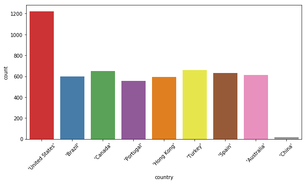
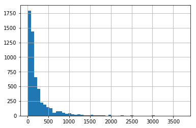
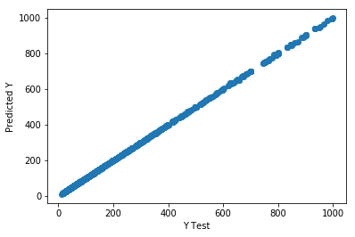

# Fairbnb?- 
Application providing extremely accurate pricing fairness estimator of Airbnb listing price

## Data
The data comes from a sample Mongo Atlas Cluster database frovided by MongoDB, which is real listings scraped for 5000 listings throughout 9 countries:  United States, Canada, Brazil, Portugal, Hong Kong, Turkey, Spain, Australia, and China.  This data is not an inclusive sample of all countries and cities is a main limitation of the data.  The original data was imported and parsed and json and then exported as a csv.

## Hypothesis:
Airbnb prices are able to be accuractely determined for a host creating a new listing, or for a guest, wanting to determine what a fair price is for a listing.  THE MOST important factor is city and most imporatantly, the speicific neighborhood.  It is not what amenities are included in the place, the reviews from past guests, or review score.

## Actions:
Data cleaning included removing outliers, listings with nightly prices over 1000$.. These prices were either mistakenly given to listings by their hosts for weekly rates or were changed by the host since the data was scraped due to not being a realistic price.  The highest priced listings were by far in Hong Kong, Rio de Janiero's Ipanema and Leblon neighborhoods, and Istanbul Turkey.  Checking the urls of these listings over 1000 a night revealed they were now more reasonable prices in the hundreds.  After removal of outliers about a thousand a night, the distribution looked like this:

Null values were filled with either the mean for continuous features, or the mode for categorical or ordinal numeric features.  
The user reviews were extracted from the json structure dictionaries with regex expressions.

Simplified binary features for has_reviews?, has_notes?, and has_neighborhood_overview?, and has_transit? if these comments columns existed. 

In the end, only the simplest, baseline model was chosen since it acheived extremely accurate results.  The baseline features chosen were:  'accommodates','bathrooms','bed_type','bedrooms','beds', 'city','state','country','government_area','review_scores_rating'

All the preprocessing of textual data was not used, except for place names. The place names were converted to binary features using pandas get dummies.  

The final shape of the features or "X" data had 553 columns and 5534 rows.  The dimensions were greatly increased after the get_dummies() becuase of the large number of geographic values.  

## Results:
After using a train/test split and running a Random Forest Regression, the model acheived the following results:
* MAE: 0.20768269831355457
* MSE: 0.6510243597751416
* RMSE: 0.8068608057001787
* R2: 0.9999841136395269

Cross Validation was used to validate that the model was overfitted to the training set.  These results proved the same.

# Summary
The most only important variables that determine the price of an airbnb listing are:
- The number of occupants the hosts place accomodates
- The number of bedrooms
- The number of bathrooms
- The number of beds
- The country
- The state (sub-region of the country)
- The city
- The government-area (This was an html title that merely refers to the municipality area, or neighborhood) of the city. 
- Review Score  (Even this is not necessary and did not change the results of the model overall)

All other features such as amenities, reviews, or the hosts own subjective notes are not that important

## Limitations:
1. The dataset is not inclusive of enough countries and cities.  This greatly limits its use with new data from unknown cities or countries to the model.  
2.  The model does not account for certian listings in rural areas that fetch a high value such as
https://www.airbnb.com/rooms/19606?source_impression_id=p3_1585434030_O8gniWXPfjFVHrgX

3.  A simple search for a listing in a certain neighborhood will already give an accurate estimate for that neighborhood using an average prices for others in that area.  
